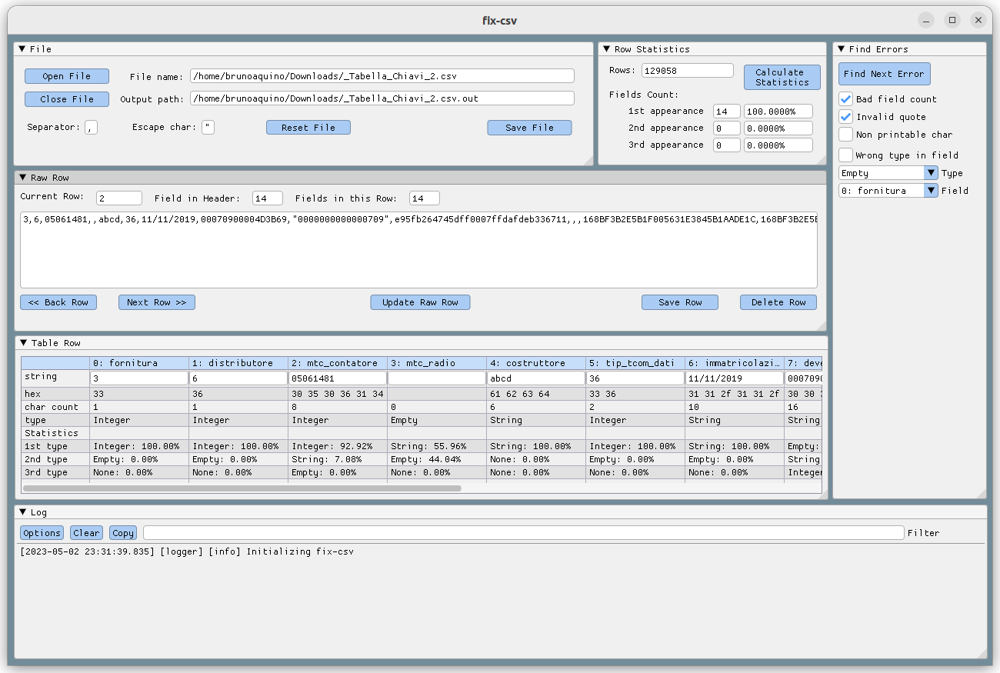

# fix-csv

## What is it?  
It's an open source (MIT license) desktop app thought to help people to investigate and fix problems in csv (comma separated values) files.  

## How to install?
Just download the last binaries, extract and run:
 - Windows: fix-csv.exe
 - Linux: fix-csv

 Dependencies:
 - Windows: DirectX 11
 - Linux: OpenGL 3 and GLFW

 ## Hot to use?
- Open the executable, if some dependecy is missing, you should receive an error message saying what is missing.

- The app should looks like this:  

- Click "Open File" and select the csv to fix, you can set separator and scape char before opens it, or you can just change then and click "Reset File".

- The first row is treated like a header, but it's ok if it's not, you can change it as though it was a normal row.

- You can resize and move any window as you want.

- A common workflow is:
    1. Open file;
    2. Calculate Statistics;
    3. Assert that on "Row Statics" window, 100% row have the same number os columns;
    4. "Next Row" and "Back Row" buttons to explorate data;
    5. Check if data types of each column is as expected;
    6. Use the "Find Error" window to find for the next row containing an error to fix or an unexpected data type;
    7. Fix or delete row: You can fix an especific column value on "Table Row" window and click "Update Raw Row" to change the row data, and them you MUST click "Save Row" to complete this row fix.
    8. Change output file name and click "Save File".

## Links and references:
- Wonderful lib Dear imgui used on this app: https://github.com/ocornut/imgui
- Some understanding of what is a valid csv: https://datatracker.ietf.org/doc/html/rfc4180

## Bugs and contribution
- Bug reporting, pull requests and code review are welcome.

